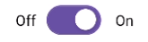
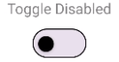
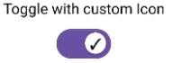
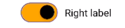
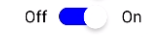
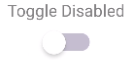

# rktlab-react-native-toggle

A custom React Native toggle component

## Installation

```sh
npm install rktlab-react-native-toggle
```
or

```sh
yarn add rktlab-react-native-toggle
```

## Usage

To use this toggle component, import the toggle component into your React Native project

The toggle has two required properties, there are

- `onValueChange`: Callback called when the toggle is pressed.
- `value`: Boolean to set the initial value of the toggle.

```js
import Toggle from 'rktlab-react-native-toggle';

export deafult function App(){
  const [active, setActive] = useState(false);
  const onValueChange = (value: boolean) => setActive(value);

  return (
    <Toggle onValueChange={onValueChange} value={active} />
  )
}
```

| Properties        | Type        | Description |
| ----------------- | ----------- | ----------- |
| onValueChange     | _function_  | Callback called when the toggle is pressed.|
| value             | _boolean_   | The value of the toggle. If true the toggle will be turned on.|
| offIcon           | _ReactNode_ | Pass a component to be rendered inside the toggles circle, example: offIcon={<Text>X</Text>}|
| onIcon            | _ReactNode_ | Pass a component to be rendered inside the toggles circle, example: onIcon={<Text>✓</Text>}|
| labels            | _string[]_  | The label or labels of the toggle, this is passed as an array, if you have a label type of `both` you can have two labels|
| labelType         | _string_    | This is the type of label. You can choose from these options: `'top' | 'left' | 'right' | 'both'` |
| disabled          | _boolean_   | If passed the component will be set to a disabled state|
| styleType         | _string_    | So far you can choose from two types of styles, `Material` or `Stock`|
| customTrackColor  | _object_    | This allows you to choose a custom style outside of the default styles for the toggle track bar.|
| customCircleColor | _object_    | This allows you to choose a custom style outside of the default styles for the switch thumb.|            |


# Examples:
## Material
- This is a toggle with both labels<br>
  
- This is a disabled toggle with a top label<br>
  
- This is a toggle with custom on and off icons<br>
  
- This is a toggle with a custom track and circle color<br>
  

## Stock
- This is a stock toggle with both labels<br>

- This is a disabled stock toggle<br>



## Contributing

See the [contributing guide](CONTRIBUTING.md) to learn how to contribute to the repository and the development workflow.

## License

MIT

---

Made with [create-react-native-library](https://github.com/callstack/react-native-builder-bob)
